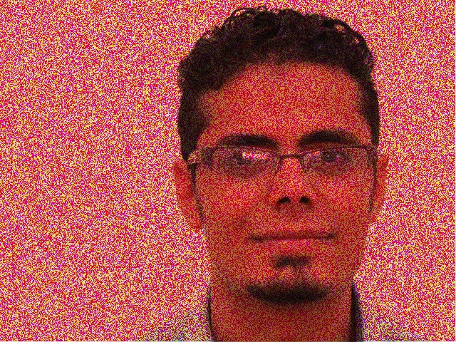

# Deniose-Image-Using-GAN

## pre-processing
1. Open terminal in the project location
    
    ```
    mkdir ./Face Dataset/input
    mkdir ./Face Dataset/target
    mkdir loaded_data
    mkdir models
    ```

    Above commands create two folders inside ./Face Dataset/ folder, one is for input to GAN and one more is for target images
 
 2. Run the preprocess.py file to add noise to images, Here we are adding noise to images and giving noise images images as 
 input images and original images as target images, So GAN will train on these kind of images and when we gave new noise image
 GAN will generate noiseless image.
 
    ```
    python preprocess.py --original './Face Dataset/original/' --input './Face Dataset/input' 
    --target 'Face Dataset/target/'
    ``` 
    ### Noise Input Image to GAN
    
    
     ### Target Image
    
    
 ## Training
   In the training GAN model will take all noise images from the ./Face Dataset/input folder and targeted images from 
   the ./Face Dataset/target folder and model will train on the these images. Some of the parameters that i used for            training are
   
    
    WIDTH = 256
    HEIGHT = 256
    EPOCHS = 300
    LR = 0.001
  
  Train the model using below command
  
    python train.py
    
  ## Testing
   
   Once the training compledted model will be stored in ./models/ folder and some of the generated images by GAN will store in ./results/ folder
   
  To generate new noise less images for noise images ( other than dataset images ) we can use test.py file
  
    python test.py --image 'path/to/input.png' --model './models/model.h5'
    
  ## Note : 
   The Database images are downloaded from the internet. Owners have full Rights
 
